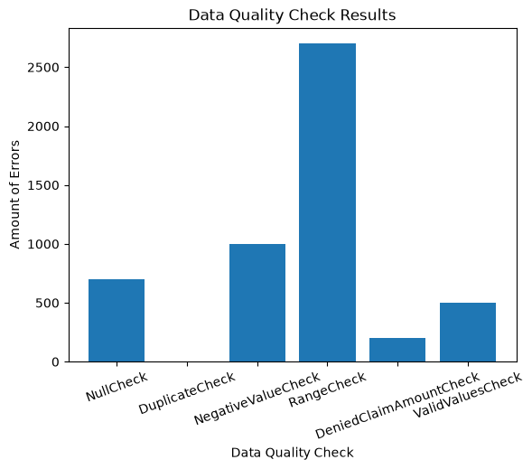

# Python Data Quality Framework

A Python-based data quality framework built to practice object-oriented programming concepts through a realistic analytics engineering use case.

The project runs reusable data quality checks against a simulated claims dataset, returns structured information about failed records, and visualizes the results using Matplotlib.

## Project Overview

The project uses a simulated dataset containing **10,000 claim records** with intentionally introduced data quality issues.

The framework evaluates the dataset using several reusable checks:

- **NullCheck** - identifies missing values
- **DuplicateCheck** - identifies duplicate values
- **NegativeValueCheck** - identifies negative numeric values
- **RangeCheck** - identifies values outside an expected range
- **ValidValuesCheck** - identifies values outside an allowed set
- **DeniedClaimAmountCheck** - identifies denied claims with a positive claim amount

Each check returns structured results including the check name, affected column, failure count, and a sample of failed claim IDs.

## Example Result

```python
{
    "check": "NullCheck",
    "table_name": "claims",
    "column": "claim_amount",
    "failure_count": 700,
    "failed_ids": [1, 2, 3, 4, 5],
    "passed": False
}
```

Only a sample of failed IDs is returned so that the results remain readable even when working with larger datasets.

## Dataset

The simulated claims dataset contains the following fields:

| Column | Description |
|---|---|
| `claim_id` | Unique identifier for each claim |
| `patient_id` | Identifier for the associated patient |
| `claim_amount` | Dollar amount associated with the claim |
| `status` | Claim status |

Data quality problems are intentionally introduced into the dataset to test the framework.

These include:

- Null claim amounts
- Negative claim amounts
- Invalid claim statuses
- Denied claims with positive amounts
- Claim amounts outside an expected range

## Object-Oriented Programming Concepts

This project was designed as a practical application of several Python OOP concepts.

### Abstraction

`DataQualityCheck` is an abstract base class that defines the common structure expected from every data quality check.

Each child class must implement a `run()` method.

### Inheritance

Individual checks inherit common attributes and behavior from `DataQualityCheck`.

This allows shared functionality to live in one place instead of being duplicated across every check.

### Polymorphism

Every check implements its own version of `run()`.

This allows `DataQualitySuite` to execute different types of checks using the same interface:

```python
result = check.run()
```

The suite does not need to know the specific type of check being executed.

### Composition

`DataQualitySuite` contains multiple data quality check objects and coordinates their execution.

Rather than being a type of data quality check, the suite **has** data quality checks.

### Encapsulation

Internal attributes use underscore naming conventions such as:

```python
self._table_name
self._column
self._data
```

Shared behavior, such as limiting the number of failed IDs returned, is also handled within the framework.

## Data Visualization

The framework results are passed to a separate visualization script.

Using **Matplotlib**, the script creates a bar chart comparing the number of failures detected by each data quality check.

Keeping visualization separate from the framework allows the data quality classes to remain focused on validation while another part of the project handles presentation.

## Project Structure

```text
data_quality_checker_py/
│
├── dataqualitycheck.py
├── visualize_results.py
├── data_quality_results.png
└── README.md
```

### `data_quality.py`

Contains:

- Simulated claims dataset
- `DataQualityCheck` abstract base class
- Individual data quality checks
- `DataQualitySuite`
- Check configuration and execution

### `visualize_results.py`

Imports the framework results and uses Matplotlib to visualize failure counts by check.



### `README.md`

Documents the project, architecture, and concepts demonstrated.

## Technologies

- Python
- Matplotlib
- Python `abc` module

## What I Learned

This project helped me move beyond learning Python syntax and apply object-oriented programming to a problem that resembles real data and analytics work.

Some of the key concepts I practiced include:

- Designing classes with clear responsibilities
- Creating reusable behavior through inheritance
- Using abstraction to enforce a common interface
- Using polymorphism to execute different objects consistently
- Using composition to coordinate multiple objects
- Encapsulating internal data and shared functionality
- Debugging data quality logic using expected record counts
- Separating validation logic from visualization

One of the biggest takeaways from this project was recognizing that writing the individual checks is only part of the problem. Designing how those checks work together, how results are structured, and how those results are communicated is equally important.
